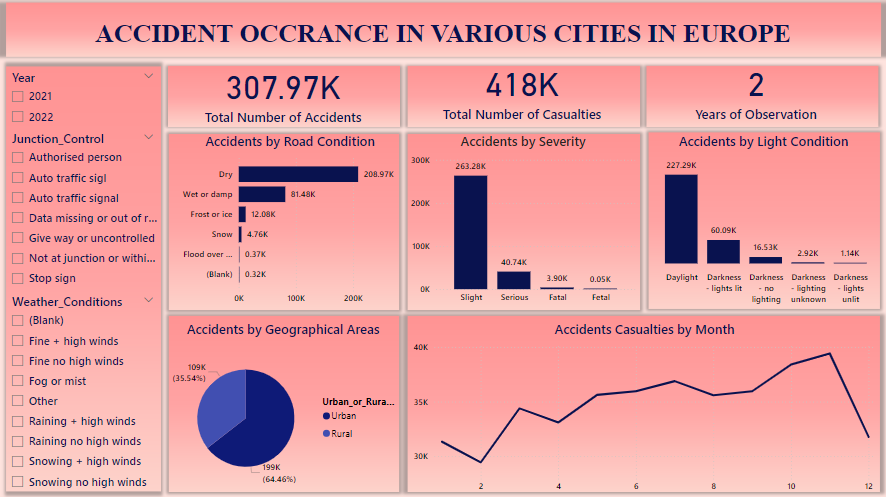

# PROJECT

## ANALYSIS ON ACCIDENT OCCURRENCE IN VARIOUS CITIES IN EUROPE

### DASHBOARD

### DATA UNDERSTANDING
Data on the occurrence of accidents in various cities in Europe Dataset has 309,719 rows and 21 columns.

### INTRODUCTION
In the world of today, there exist a lot of road accident cases, using the Continent Europe as a case study, analysis would be made to illustrate the the effect of these accident and its major causes.

### PROBLEM STATEMENT
We would like to inquire about the frequency of accidents in Europe in 2021 and 2022, as well as the total number of casualties resulting from these incidents, how severe the accident was on the total number of casualties, the weather conditions during these accidents, and the road condition that accident occurs the most. 

### OBJECTIVE 
To understand the occurrence of accidents in Europe in 2021 and 2022, investigate the primary causes, assess the resulting damages and identify the most commonly ignored signs.

### ANALYTICAL TECHNIQUES
Descriptive 

### BENEFIT OF ANALYSIS
This analysis is carried out to ascertain the major causes of accidents, how severe the effect of the accident was, how many casualties have occurred in Europe due to accidents and how to prevent accidents.

### QUESTIONS OUGHT TO BE ASKED 
- What is the count of accidents during the years considered for this analysis? 
- How many casualties were involved in the accident? 
- How many years is considered for this analysis?
- What is the count of accidents by ? 
- How serious were the casualties involved in these accidents?  
- How were these accidents distributed among various weather conditions? 
- Which geographical area do accidents occur the most? 
How many casualties are involved in each month 

### DATA DICTIONARY 
- Accident Tally: Daily count of accident occurrence. 
- Accident Date: The date the accident occurred. 
- Year: The year the accident occurred. 
- Junction Control: The management and regulation of traffic flow at a junction (traffic signs). 
- Accident Severity: The damage resulting from the accident. 
- Light Conditions: The amount of natural or artificial light during the accident. 
- Number of Casualties: The number of people that were affected due to the accident. 
- Road Surface Condition: The quality of the road during the accident. 
- Rural or Urban: The geographical area the accident occurred in. 
- Weather Condition: The atmospheric state during the accident. 

### DATA PRESENTATION 
- Data Cleaning – Power Query 
- Visualization – Power BI 

### FINDINGS 
- Accident occurrence in Europe within a period of two years was at a high rate of almost half a million. 
- The severe causality was not a large fraction as most of the causality was slight.
- There didn’t exist much potential danger that could have caused the accident.
- Most accidents occur during the day. 
- Most of these accidents occur in the urban area as compared to the rural area. 
- The month November recorded 39414 casualties as the month with the highest record of casualties while the month February recorded 29452 as the month with the least record of casualties.

### CONCLUSION
From the analysis, it is evident that during the two-year period, there has been a significant number of daily accidents, mostly occurring during the day and on dry roads. Everyone is urged to be cautious during these times, as most accidents result from disobeying traffic regulations. Addressing these factors could reduce the accident rate.
